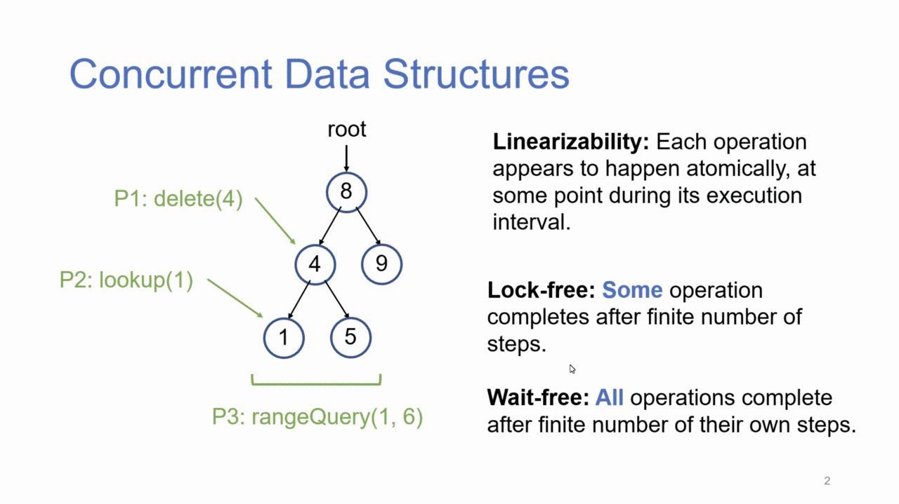
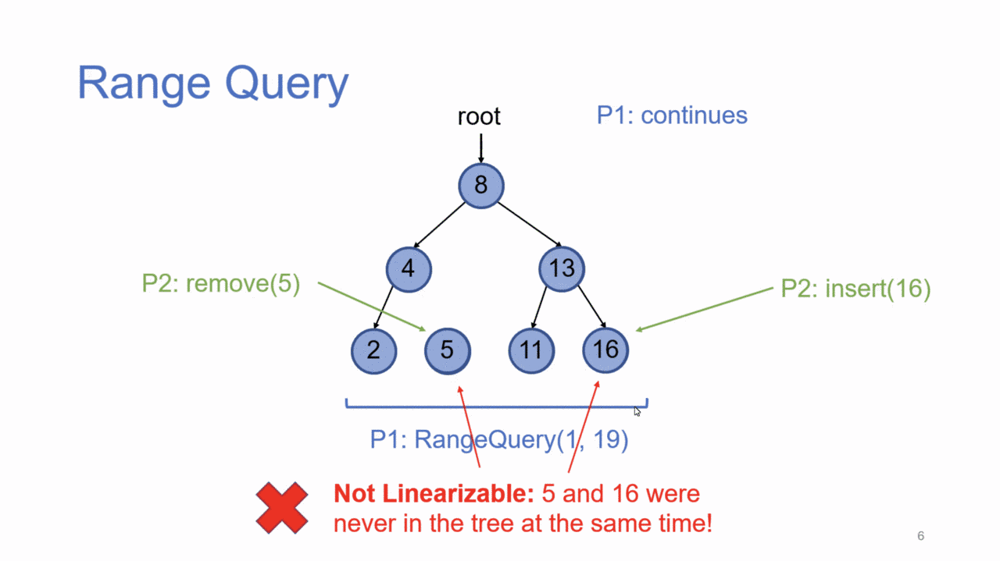
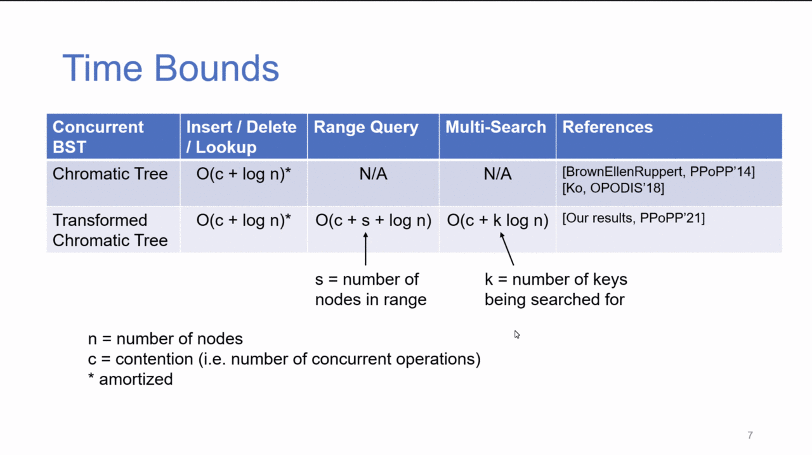
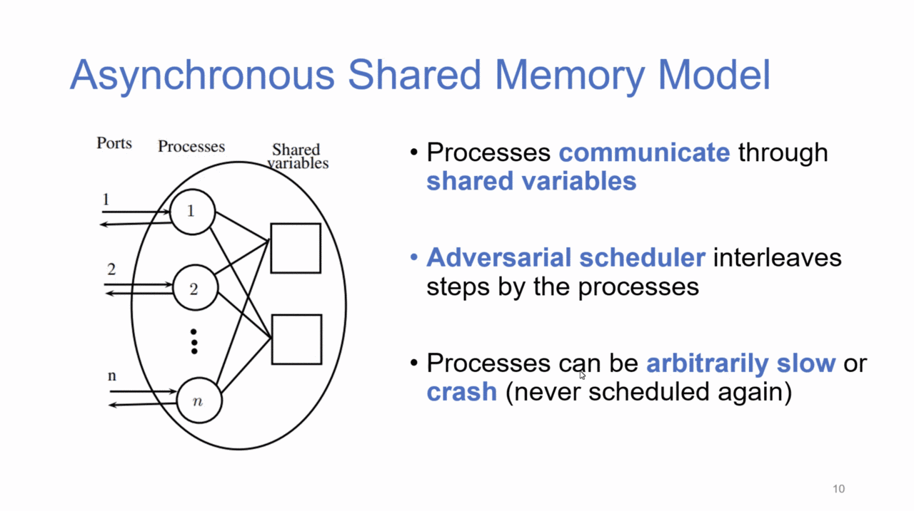
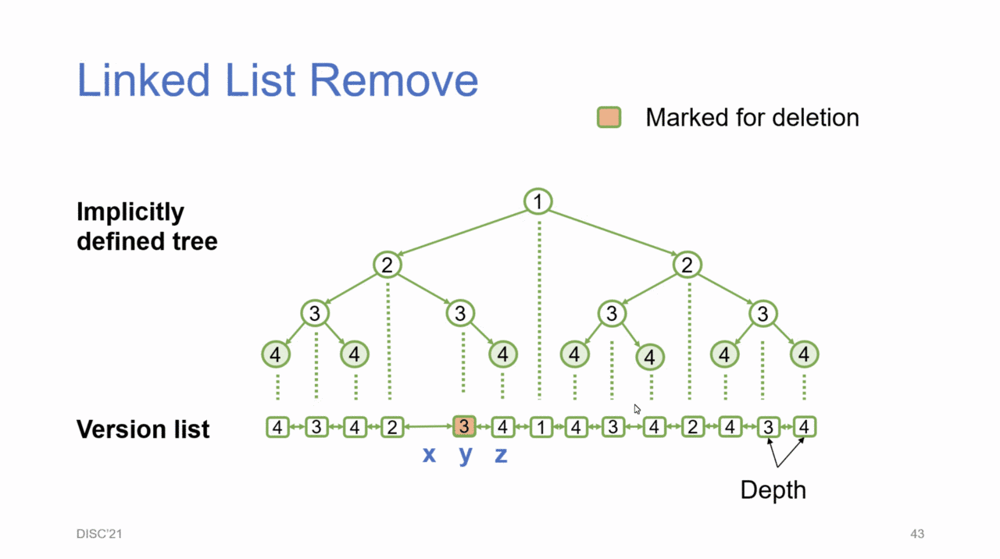

# Concurrent Datastructure Techniques for Multi-Point Queries

<http://s.gilgamesh.cc/29>, by Yuanhao Wei
2021-12-08

* Single-point vs. multi-point queries.

*Linearizability is violated.*

* Compare & Swap (CAS) operation very important in model.
